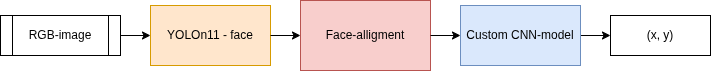
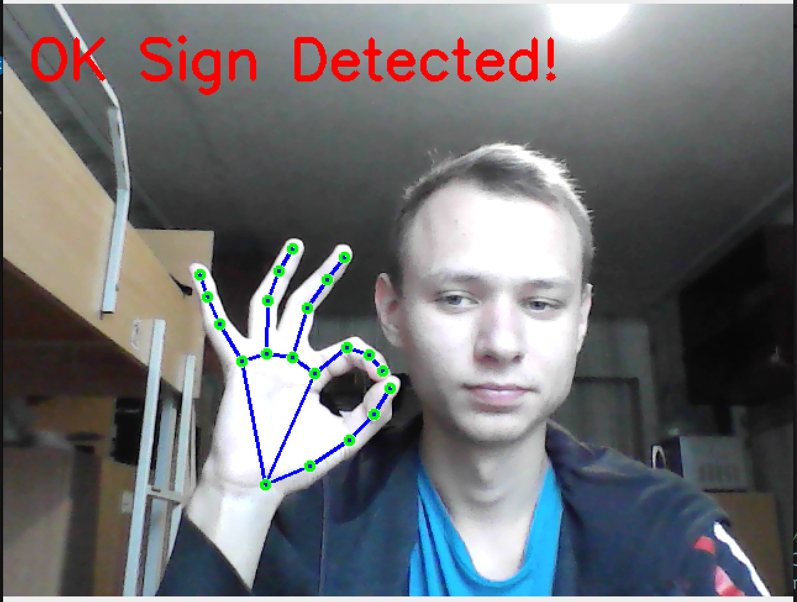
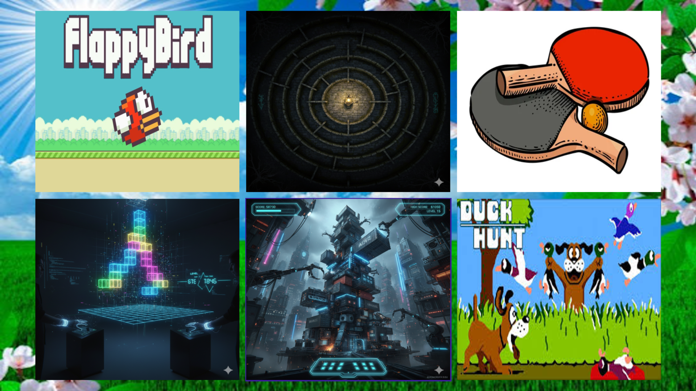

# gaze-projection-on-screen
This project is created to find where is user looking on at the screen. Includes demo version, training scripts and several instances for user gaze screen-management. Also I propose sign cursor control from ```mediapipe``` pretrained hand features.

We propose a pipeline for gaze projection, based on such arcitecture: face detection from YOLO (yolov11n-face), then this image goed into face-alligment (from basic face-alligment module of python, read requirements). All information of these proceddures is given to custom ML-model, based on ResNet-18, which translates it to the coordinates on the screen.



Program enable sighns-control and sleep-open eyes detection.



To install all dependencies and requirement use:

```bash
python3 -m venv .venv
source ./.venv/bin/activate
# .venv/Scripts/activate  # for Windows
pip install -r requirements.txt
```

To create dataset for training (to proper training you need to look at the point on frame, than click on english letter d(D) to take a picture and l(L) to pass this frame. Enter 'esc' to escape):

Dataset structure:
```txt
dataset/
├── images/
│   ├── image1.png
│   ├── image2.png
│   ├── image3.png
│   └── ...
├── labels/
│   ├── image1.txt
│   ├── image2.txt
│   ├── image3.txt
│   └── ...
└── annotations.csv
```

Code for creating such dataset:

```bash
python3 dataset_creating.py
```

To train your model you need to run file ```training.py```, with following parameters:
```bash
python3 training.py -h
```
Example of usage:
```bash
python3 training.py 
    --csv ./dataset/common_dataset/anotations.csv
    --mode direct_screen
    --train
    --train_dir ./dataset/common_dataset/images
    --epochs 30
    --batch 32
    --outdir checkpoints
```

To lounch testing of model proper work, with only white points on dark screen looking on yout face:

```bash
python3 testing.py
```

To launch several games, to rest yourself after hard working, or to demo of proper model, and to use your model you can run:

```bash
python3 ./application/launcher.py
```

its a louncher of a program interface with several games from my contributor (he don't want to be included into repository), with my user interface and ideas

detection.



In config you can choose an option to manage program by hand, set other options of control etc.
```bash
nvim ./application/global_config.py
```

Enjoy this program and have a nice day!
